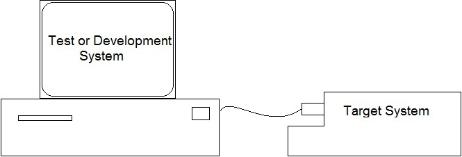
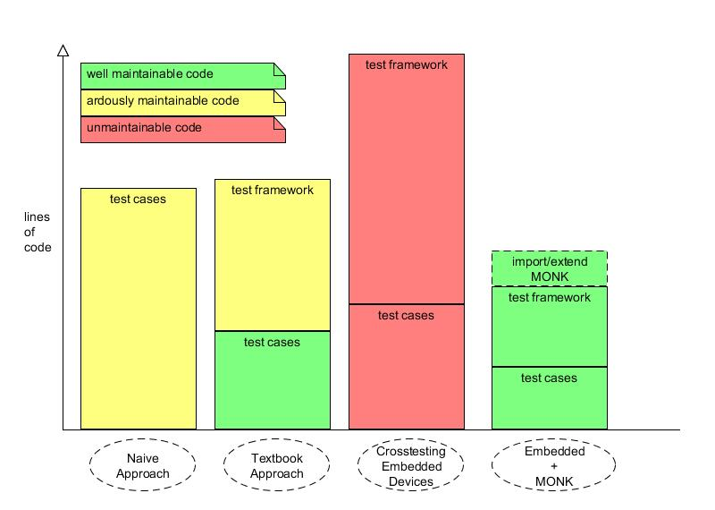

.. MONK Cross-Testing Framework master file, created by
   sphinx-quickstart on Thu Aug  9 11:10:24 2012.
   You can adapt this file completely to your liking, but it should at least
   contain the root `toctree` directive.

################################
MONK the Cross-Testing Framework
################################

If you ever developed software on one
:term:`architecture <target vs development system>` for another, then
you already heard the term :term:`cross-compiling`. The term means you compile
software in one architecture for another. Using cross-compiling is quite
helpful for developers who don't use high level languages like Java for their
codebase. In some situations it is the only way. How else would you compile
the first compiler for a new architecture?

MONK does the same for testing :term:`embedded systems <embedded
system>`. You have one machine, that executes tests by interacting with one or
many :term:`target systems <target vs development system>`. The deployment of
your code and configuration of the test environment can be done with the help
of MONK. 

    Figure 1: Cross-testing with MONK

**What a cross-compiler is for your production code, 
is MONK  for your test scripts, and in some regards even more!**

******
Vision
******

Here is how MONK was envisioned by it's developers: 

    Image 1: The vision of testing with MONK

The first approach shows how most people would consider writing software tests
after learning about it. With more experience and some theory under their belt
they will write software tests more like in the second approach. And this
all works fine in the traditional software development. The 
:term:`test framework` is sometimes harder to maintain, but it is manageable.
But if you add the complexity of embedded systems into the mix, then
the tests become so complex that they themself might not be maintainable
anymore. Also the amount of test code might become so big, that devs might
consider forgetting about automated tests at all.

MONK was created to make impossible software tests for embedded systems
possible, and enjoyable when they would be frustrating otherwise.

***********************************
How Using MONK Might Look Like Soon
***********************************

MONK is still a project in early development, and you will definitely find
it harsher to use than in the following example. Yet it is always important to
have a clear vision of what to expect from the future.

.. literalinclude:: future.py
    :linenos:
    :lines: 18-

The parameters of ``monk.TestCase.prepare()`` are the most powerful and
most important interactions with the monk framework. In these the scripter
says, what kind of general test he wants to write (the :term:`Usecase`) and
then modifies it to his liking. 

.. literalinclude:: future.py
    :linenos:
    :lines: 25-
    :emphasize-lines: 2

The ``#default`` comment shows, that a line contains the default value. This
means you don't actually need to write that.

The next part contains the binaries:

.. literalinclude:: future.py
    :linenos:
    :lines: 25-
    :emphasize-lines: 3

The ``bins`` parameter contains the binaries that you want to build. In this
case a simple binary will be downloaded from a github repository and then
installed with ``$ make`` and ``$ make install``. Of course all that could be
changed. You could supply another branch, commit, a binary instead of a
repository or another build tool like Ant or distutils. Keep also in mind that
it is possible to simply add more binaries with adding more objects to the
tuple.

.. literalinclude:: future.py
    :linenos:
    :lines: 25-
    :emphasize-lines: 4-10

The logs contain the log files that you want to watch on the :term:`target
device <target vs development system>`. There are 2 Log objects, because 2
different logs should be watched. For each log you have to give 3 attributes:
The path to the log on the filesystem, regular expressions MONK should look for
and a ``line_handling``, which means how the already existing lines in a log
file should be treated. For the ``line_handling`` there are 2 possible states
at the moment, one is ``monk.Log.ALL``, which is also the default, and
``monk.Log.LAST`` which ignores all existing lines when checking for your
regular expressions.

.. literalinclude:: future.py
    :linenos:
    :lines: 25-
    :emphasize-lines: 11-14

The last important parameter of ``prepare()`` contains the commands, that
should be executed in your test. Each ``monk.CMD`` object contains a
``cmd_line``, which is what MONK executes over a connection, and regexes that
the output should be checked against. As with ``monk.Log`` objects there is the
option to overwrite the ``line_handling`` but at the current state there are no
menaingful usecases for this.

***************
Further Reading
***************
.. toctree::
   :maxdepth: 2

   getting-started
   contributing
   api-docs
   glossary

