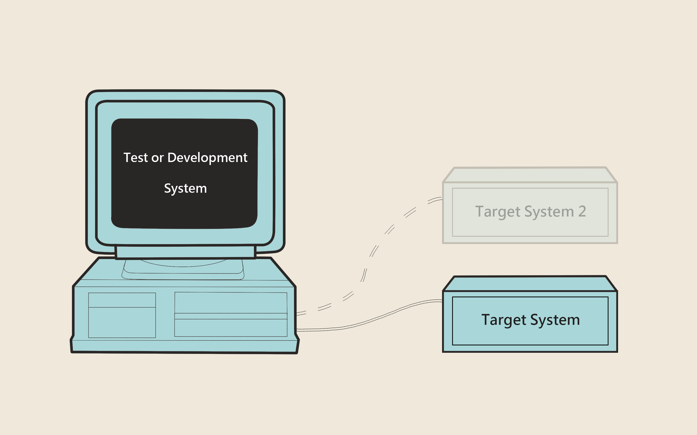
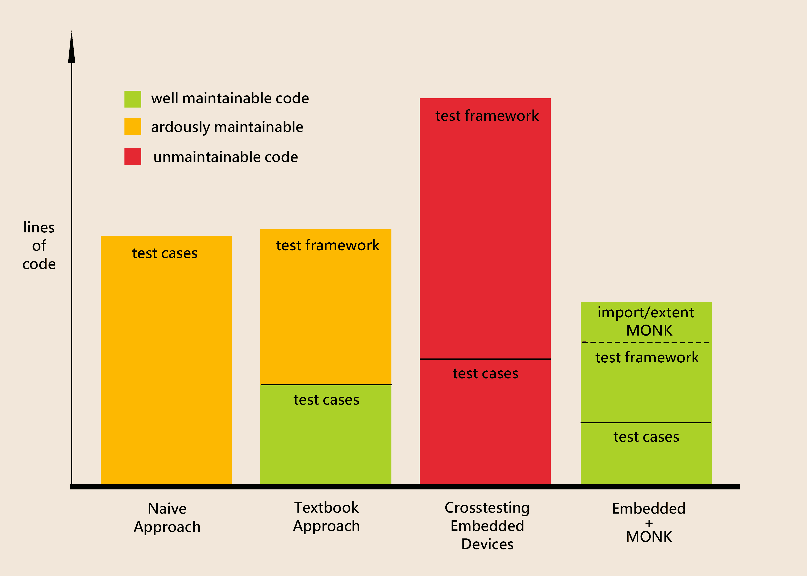

.. MONK Cross-Testing Framework master file, created by
   sphinx-quickstart on Thu Aug  9 11:10:24 2012.
   You can adapt this file completely to your liking, but it should at least
   contain the root `toctree` directive.

################################
MONK the Cross-Testing Framework
################################

If you have ever developed software on one
:term:`architecture <target vs development system>` for another, then
you have already heard the term :term:`cross-compiling`, meaning you compile
software on one architecture for use on another. Using cross-compiling is
quite helpful for developers who don't use high level languages like Java for
their codebase. In some situations it is the only way. How else would you
compile the first compiler for a new architecture?

MONK does the same for testing :term:`embedded systems <embedded
system>`. One machine (the test system) executes tests by interacting with
one or many other machines
(:term:`target systems <target vs development system>`). The deployment of
your code and configuration of the test environment can be done with the
help of MONK.

**What a cross-compiler is for your production code,
MONK is for your test scripts, and in some regards even more!**

    Cross-testing with MONK

******
Vision
******

Here is how MONK was envisioned by its developers:

    The vision of testing with MONK

The first approach shows the way most people consider writing software tests
after first learning about the concept. With more experience and some
theoretic background they will probably use an approach as shown in column 2.
This works fine in traditional software development. Typically, the
:term:`test framework` is harder to maintain than the test cases themselves,
but it still is manageable.

If, however, you add the complexity of embedded systems into the mix, then
the tests become so complex that they themselves might not be maintainable
anymore. Additionally, the amount of test code might become so big, that
developers might be tempted to forget about automated tests at all.

MONK was created to make impossible software tests for embedded systems
possible, and even enjoyable, when they would be frustrating otherwise.

************************************
What Using MONK Might Look Like Soon
************************************

MONK still is a project in early development, and you will definitely find
it harder to use than in the following example. Still, it is always important
to have a clear vision of what to expect from the future.

.. literalinclude:: future.py
    :linenos:
    :lines: 18-

The parameters of ``monk.TestCase.prepare()`` are the most powerful and
most important interactions with the MONK framework. With these the developer
of a test case tells MONK, what kind of test he wants to use (the
:term:`Usecase`) and then modifies it to his liking. 

.. literalinclude:: future.py
    :linenos:
    :lines: 25-
    :emphasize-lines: 2

The ``#default`` comment shows, that a line contains the default value. This
means you don't actually need to write that.

.. literalinclude:: future.py
    :linenos:
    :lines: 25-
    :emphasize-lines: 3

The ``bins`` parameter contains the binaries you want to build. In this
case a simple binary will be downloaded from a github repository and then
installed with ``$ make`` and ``$ make install``. Of course all of this might
be modified according to your needs.
You could supply another branch, commit, a binary instead of a
repository or another build tool like Ant or distutils. Also keep in mind that
it is possible to simply add more binaries by adding more objects to the
tuple.

.. literalinclude:: future.py
    :linenos:
    :lines: 25-
    :emphasize-lines: 4-10

The ``logs`` parameter contains the log files you want to watch on the
:term:`target device <target vs development system>`. In the example, there
are 2 log objects because 2 different logs are to be watched. You have to
provide 3 attributes for each log: the path to the log in the file system,
regular expressions MONK should look for and a ``line_handling`` telling MONK
how to treat lines created before the start of the test. At the moment we
intend to implement two possible states for ``line_handling``:
``monk.Log.ALL``, meaning all lines will be evaluated (which is the default),
and ``monk.Log.LAST``, which ignores all existing lines when checking
for your regular expressions.

.. literalinclude:: future.py
    :linenos:
    :lines: 25-
    :emphasize-lines: 11-14

The last important parameter of ``prepare()`` contains the commands that
should be executed in your test. Each ``monk.CMD`` object consists of a 
``cmd_line`` that is executed on the target system by MONK, and regular
expressions that the output should be checked against. As with ``monk.Log``
objects there is the option to overwrite set ``line_handling``, but at the
moment there are no menaingful usecases for this.

***************
Further Reading
***************
.. toctree::
   :maxdepth: 2

   getting-started
   contributing
   codingstyle
   modules
   glossary

